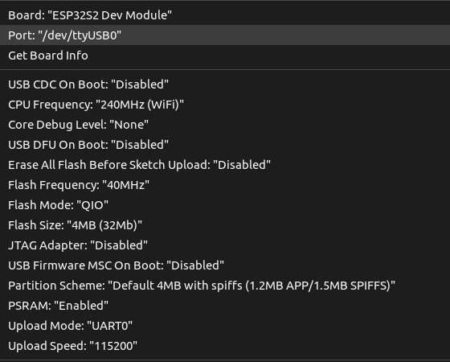

# ESP32-S2 Image Uploader

this project captures the image using the ESP32S2 module and OV2460 CAM module to capture the image and post it to the express server(intermediate server) the express server listens to the incoming post requests and using AWS sdk Uploads it to the AWS s3 bucket.
## Prerequisites 
- ESP32-S2 Module
- OV2460 Cam Module

## Getting Started
1. Install the esp32-s2 support for the Arduino IDE by following the instruction In the  https://github.com/espressif/arduino-esp32  
1. Open the main.io file in Arduino IDE
1. Enter the wifi credentials   
    ```c
    const char *ssid = " ID "
    const char *password = "password"
    ```

1. It captures images every 30 seconds and sends it to your Node.js server over a TCP socket connection. Node.js server will handle the received image data and upload it to AWS S3.
## Arduino IDE configuration  
For the ESP32-S2 dev module select the following options:   

<!-- - Board: esp32-s2wrover 
- Port: ttyUSB0
- CPU frequency: "240MHz (WiFi/BT)"
- Flash Frequency: "80MHz"
- Flash mode: "DIO"
- psram: enable -->


